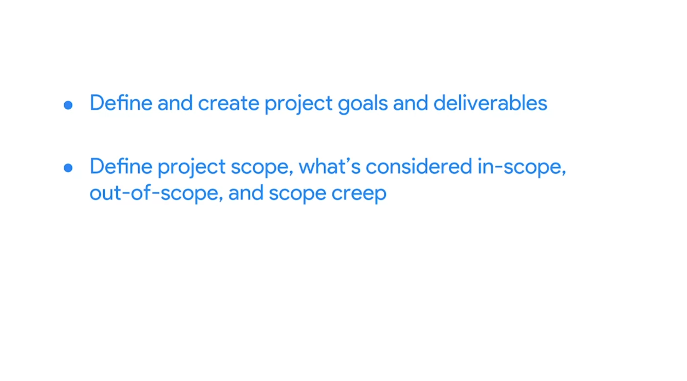
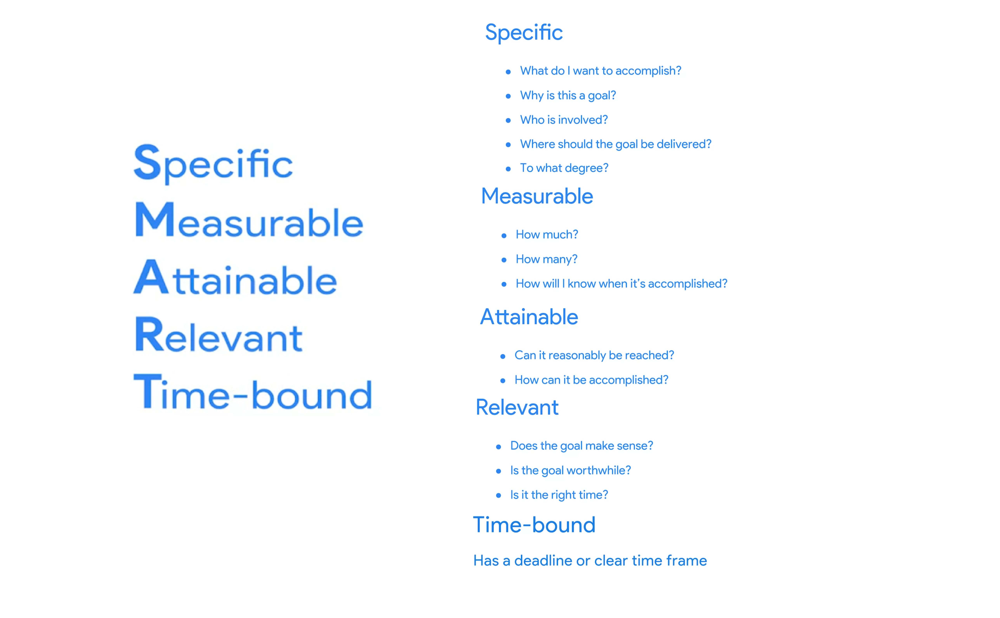
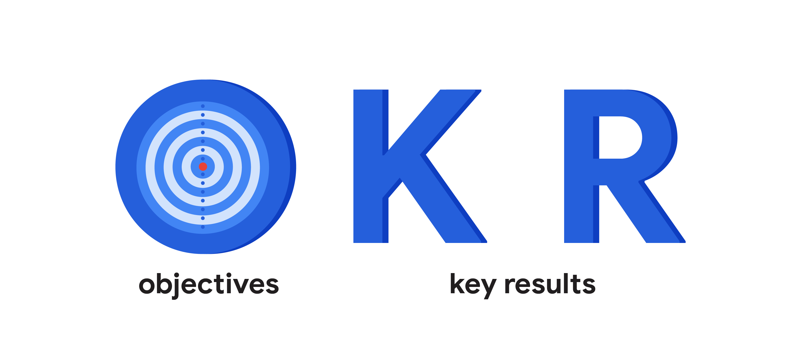
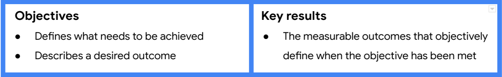
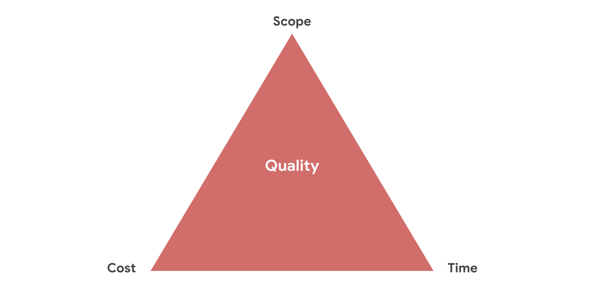
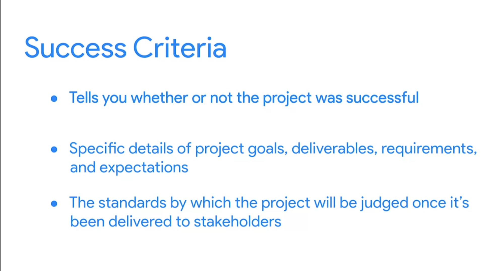

# Defining project goals, scope, and success criteria
 ## Define project goals

## SMART goals: Making goals meaningful
Let's focus on SMART goals: Specific, Measurable, Attainable, Relevant, and Time-bound (SMART) goals are very helpful for ensuring project success. As you start your career in project management, you may not directly set the project goals, but you should be able to clarify and understand them. SMART goals help you see the full scope of a goal, determine its feasibility, and clearly define project success in concrete terms. 

- Specific: The objective has no ambiguity for the project team to misinterpret. 
- Measurable: Metrics help the project team determine when the objective is met.
- Attainable: The project team agrees the objective is realistic.
- Relevant: The goal fits the organization’s strategic plan and supports the project charter.
- Time-bound: The project team documents a date to achieve the goal.

You may see variations on what each letter in the “SMART” acronym stands for. (For example, you may see “actionable” or “achievable” instead of “attainable” or “realistic” instead of “relevant.”) However, the general intent of each of these terms—to make sure the goal is within reach—is always similar.

### Key takeaway
Determining metrics can be extremely helpful in capturing statuses, successes, delays, and more in a project. As a project manager, identifying meaningful metrics can help move the project toward its goal. Additionally, by defining each element of a project goal to make it SMART, you can determine what success means for that goal and how to achieve it. 

## Creating OKRs for your project
OKR stands for objectives and key results. They combine a goal and a metric to determine a measurable outcome.

Company-wide OKRs are used to set an ultimate goal for an entire organization, whole team, or department. Project-level OKRs describe the focused results each group will need to achieve in order to support the organization.

### OKRs and project management
As a project manager, OKRs can help you expand upon project goals and further clarify the deliverables you’ll need from the project to accomplish those goals. Project-level OKRs help establish the appropriate scope for your team so that you can say “no” to requests that may get in the way of them meeting their objectives. You can also create and use project-level OKRs to help motivate your team since OKRs are intended to challenge you to push past what’s easily achievable. 

### Creating OKRs for your project
#### Set your objectives
Project objectives should be aspirational, aligned with organizational goals, action-oriented, concrete, and significant. Consider the vision you and your stakeholders have for your project and determine what you want the project team to accomplish in 3–6 months.

#### Examples:
- Build the most secure data security software 
- Continuously improve web analytics and conversions
- Provide a top-performing service
- Make a universally-available app
- Increase market reach
- Achieve top sales among competitors in the region

Strong objectives meet the following criteria. They are:
- Aspirational
- Aligned with organizational goals
- Action-oriented
- Concrete
- Significant

To help shape each objective, ask yourself and your team:
- Does the objective help in achieving the project’s overall goals?
- Does the objective align with company and departmental OKRs?
- Is the objective inspiring and motivational?
- Will achieving the objective make a significant impact?

#### Develop key results
Next, add 2–3 key results for each objective. Key results should be time-bound. They can be used to indicate the amount of progress to achieve within a shorter period or to define whether you’ve met your objective at the end of the project. They should also challenge you and your team to stretch yourselves to achieve more.

#### Examples:
- X% new signups within first quarter post launch
- Increase advertiser spend by X% within the first two quarters of the year
- New feature adoption is at least X% by the end of the year
- Maximum 2 critical bugs are reported monthly by customers per Sprint
- Maintain newsletter unsubscribe rate at X% this calendar year

Strong key results meet the following criteria:
- Results-oriented—not a task
- Measurable and verifiable
- Specific and time-bound
- Aggressive yet realistic

To help shape your key results, ask yourself and your team the following:
- What does success mean?
- What metrics would prove that we’ve successfully achieved the objective?

#### OKR development best practices
Here are some best practices to keep in mind when writing OKRs:
- Think of your objectives as being motivational and inspiring and your key results as being tactical and specific. The objective describes what you want to do and the key results describe how you’ll know you did it. 
- As a general rule, try to develop around 2–-3  key results for each objective.
- Be sure to document your OKRs and link to them in your project plan.

## Define project scope
Imagine that while working in a restaurant management group, your manager calls and asks you to “update the dining space,” then quickly hangs up the phone without providing further instruction. In this initial handoff from the manager, you are missing a lot of information. How do you even know what to ask? Here are some questions you might ask your manager in order to get the information you need to define the scope of the project:
### Stakeholders
- How did you arrive at the decision to update the dining space? 
- Did the request originate from the restaurant owner, customers, or other stakeholders? 
- Who will approve the scope for the project? 

### Goals
- What is the reason for updating the dining space? 
- What isn't working in the current dining space? 
- What is the end goal of this project? 

### Deliverables
- Which dining space is being updated? 
- What exactly needs to be updated? 
- Does the dining space need a remodel? 

### Resources
- What materials, equipment, and people will be needed? 
- Will we need to hire contractors? 
- Will we need to attain a floor plan and building permits? 

### Budget
- What is the budget for this project? Is it fixed or flexible? 

### Schedule
- How much time do we have to complete the project? 
- When does the project need to be completed? 

### Flexibility
- How much flexibility is there? 
- What is the highest priority: hitting the deadline, sticking to the budget, or making sure the result meets all the quality targets? 

### Key takeaway
Taking the time to ask questions and ensure that you understand the scope of the project will help reduce expenses, rework, frustration, and confusion. Make sure you understand the who, what, when, where, why, and how as it applies to the scope. If you are missing any of that information, focus your questions on those elements. The initiation phase of the project sets the foundation for the project, so ensuring that you understand the scope and expectations during this stage is essential. 

### Scope management best practices
The scope of a project can get out of control quickly—so quickly that you may not even notice it. Scope creep is when a project’s work starts to grow beyond what was originally agreed upon during the initiation phase. Scope creep can put stress on you, your team, and your organization, and it can put your project at risk. The effects of scope creep can hinder every aspect of the project, from the schedule to the budget to the resources, and ultimately, its overall success. 

Here are some best practices for scope management and controlling scope creep: 
- **Define your project’s requirements**. Communicate with your stakeholders or customers to find out exactly what they want from the project and document those requirements during the initiation phase. 
- **Set a clear project schedule**. Time and task management are essential for sticking to your project’s scope. Your schedule should outline all of your project’s requirements and the tasks that are necessary to achieve them.
- **Determine what is out of scope**. Make sure your stakeholders, customers, and project team understand when proposed changes are out of scope. Come to a clear agreement about the potential impacts to the project and document your agreement. 
- **Provide alternatives**. Suggest alternative solutions to your customer or stakeholder. You can also help them consider how their proposed changes might create additional risks. Perform a cost-benefit analysis, if necessary.
- **Set up a change control process**. During the course of your project, some changes are inevitable. Determine the process for how each change will be defined, reviewed, and approved (or rejected) before you add it to your project plan. Make sure your project team is aware of this process.
- **Learn how to say no**. Sometimes you will have to say no to proposed changes. Saying no to a key stakeholder or customer can be uncomfortable, but it can be necessary to protect your project’s scope and its overall quality. If you are asked to take on additional tasks, explain how they will interfere with the budget, timeline, and/or resources defined in your initial project requirements. 
- **Collect costs for out-of-scope work**. If out-of-scope work is required, be sure to document all costs incurred. That includes costs for work indirectly impacted by the increased scope. Be sure to indicate what the charges are for. 

At times, project managers may refer to the triple constraint model to manage scope and control scope creep. It can serve as a valuable tool to help you negotiate priorities and consider trade-offs.

## Define project's success criteria
Delivering the final result of your project to the client or user is what's called a **project launch**. On the other hand, **Landing** is when you actually measure the success of your project using the success criteria established at the outset of the project.

### Launching vs. landing a project
In project management, a project “launching” means you have delivered the final results of the project to the client or user. You can’t solely base project success on when the client accepts the project, though. Your work on a project won’t be complete until you “land” it by thoroughly measuring the results. This is when the success criteria and the metrics you defined initially when setting SMART goals will come in handy.  

Teams should be clear on what they are trying to accomplish, beyond just launching something to users. Will your project increase retention? Will your project speed up a product feature? Depending on the product and situation, the answers will differ, but it is important that your team aligns and works toward the same measurable goal. 

Launching your project to the client can be a very big moment for you. You handed over the project to your client and now you can take a step back and breathe. But make sure you land your project, as well. Look over your notes, talk with your team, meet with the client, and remember to return to your intended deliverables and metrics to help you measure success. 

#### Product quality
To measure the success of a product, consider including these metrics on your checklist: 
- Track if you implemented the product’s priority requirements
- Track and assess the product’s number of technical issues or defects
- Measure the percentage of features you delivered or released at the end of the project

#### What is important to the customers or stakeholders 
Metrics to consider include:
- Evaluating user engagement with the product 
- Measuring stakeholder and customer satisfaction via surveys
- Tracking user adoption of the product by using sales data