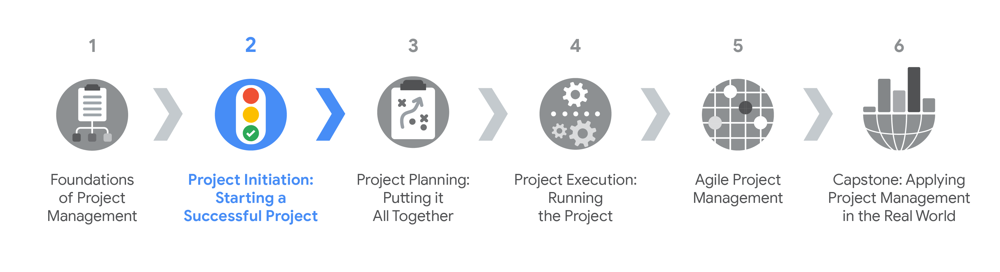

# Project Initiation: Starting a Successful Project
The knowledge base contanis a specialization overview from the course [Project Initiation: Starting a Successful Project](https://www.coursera.org/learn/project-initiation-google?specialization=google-project-management) by Google on [Coursera](https://www.coursera.org/). It is divided into following modules:
- [Fundamentals of project initiation](./Fundamentals%20of%20project%20initiation.md)
- [Defining project goals, scope, and success criteria](./Defining%20project%20goals,%20scope,%20and%20success%20criteria.md)
- [Working effectively with stakeholders]()
- [Utilizing resources and tools for project success]()

This is the second course in the Google Project Management Certificate program. This course will show you how to set a project up for success in the first phase of the project life cycle: the project initiation phase. In exploring the key components of this phase, you’ll learn how to define and manage project goals, deliverables, scope, and success criteria. You’ll discover how to use tools and templates like stakeholder analysis grids and project charters to help you set project expectations and communicate roles and responsibilities.

By the end of this course, you will be able to: 
- Understand the significance of the project initiation phase of the project life cycle. 
- Describe the key components of the project initiation phase. 
- Determine a project’s benefits and costs.
- Define and create measurable project goals and deliverables. 
- Define project scope and differentiate among tasks that are in-scope and out-of-scope. 
- Understand how to manage scope creep to avoid impacting project goals.
- Define and measure a project’s success criteria. 
- Complete a stakeholder analysis and explain its significance.
- Utilize RACI charts to define and communicate project team member responsibilities.
- Understand the key components of project charters and develop a project charter for project initiation.
- Evaluate various project management tools to meet project needs.

[Here](https://www.coursera.org/account/accomplishments/verify/WEL8AUCN7ABG) is my certification for this first course.

## Certification Overview
###  Google Project Management Certification
**Project managers** are natural problem-solvers. They set the plan and guide teammates, and manage changes, risks, and stakeholders. This [Google Project Management: Professional Certificate](https://www.coursera.org/professional-certificates/google-project-management) includes over 140 hours of instruction and hundreds of practice-based assessments which will help you simulate real-world project management scenarios that are critical for success in the workplace. The content is highly interactive and exclusively developed by Google employees with decades of experience in program and project management.

**Skills you’ll gain will include**: Creating risk management plans; Understanding process improvement techniques; Managing escalations, team dynamics, and stakeholders; Creating budgets and navigating procurement; Utilizing  project management software, tools, and templates; Practicing Agile project management, with an emphasis on Scrum.

Through a mix of videos, assessments, and hands-on activities, you’ll get introduced to initiating, planning, and running both traditional and Agile projects. You’ll develop a toolbox to demonstrate your understanding of key project management elements, including managing a schedule, budget, and team.

### Certification Content

The [Google Project Management: Professional Certificate](https://www.coursera.org/professional-certificates/google-project-management) contains six courses.

- Foundations of Project Management
- **Project Initiation: Starting a Successful Project**
- Project Planning: Putting It All Together
- Project Execution: Running the Project
- Agile Project Management
- Capstone: Applying Project Management in the Real World

Most of the content is from the course itself. © Google and Coursera.