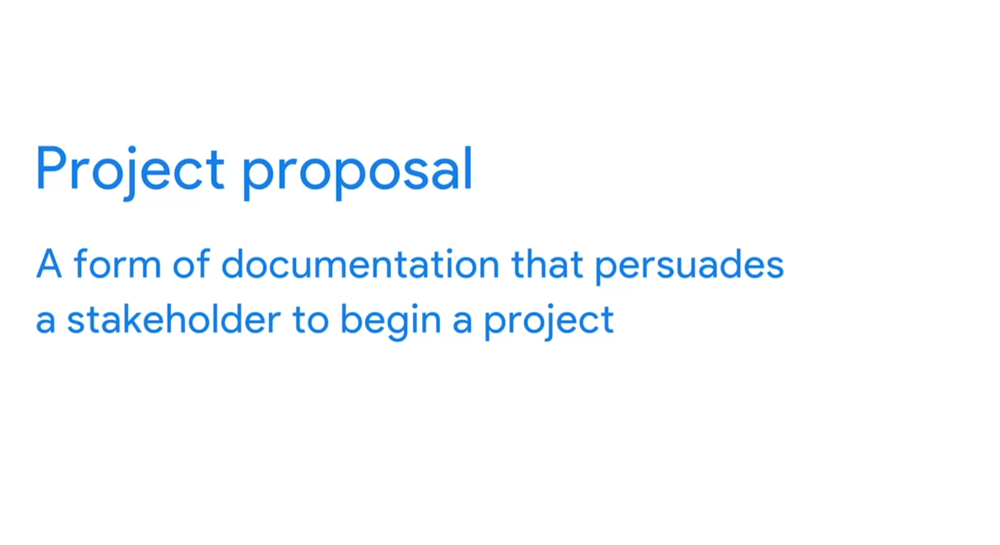
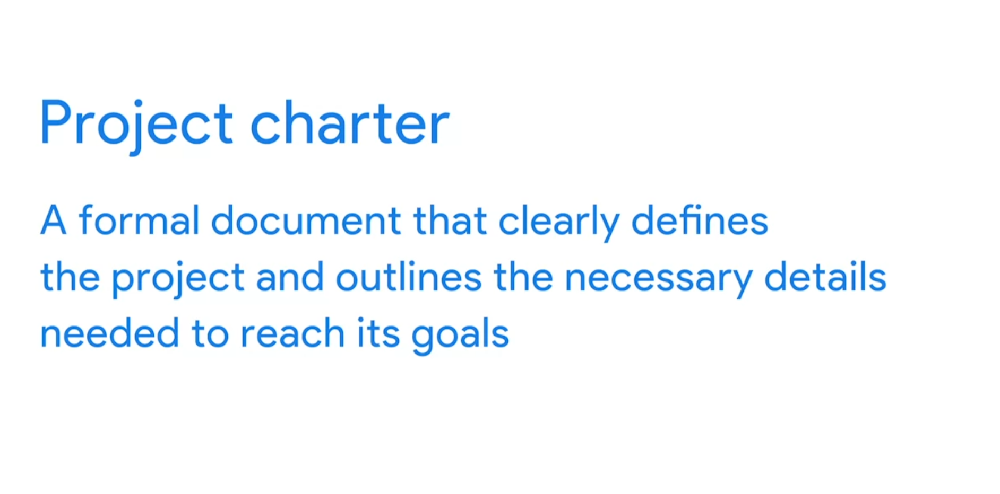

# Utilizing resources and tools for project success

## Managing resources to get the job done

Let’s consider the importance of project resources. Project resources are who and what you depend on to complete a project, including budget, materials, and people. While each resource is a separate entity, they all depend on one another—your team cannot do the work without materials, and you cannot purchase materials without a budget.

### Budget
Have you ever created a budget for yourself or your family? If you have, you know that a budget includes a wide variety of expenses. For example, a monthly personal budget can contain items that include anything from food to transportation costs to rent. With only a certain amount of funding to cover each expense, it is important to closely monitor your spending to avoid going over budget. If you go over in one category of your budget, you will impact the others and will need to make adjustments. As a project manager, you will take the same general approach with your project budget. Common aspects of your project budget will include:
- Team: the cost of the people performing the work
- Services: any outside vendors helping your project
- Materials: any tangible items purchased to complete the project

Throughout your project management career, you will encounter various types of projects with a wide range of budgets. Some budgets will have no margin for error, whereas other budgets may be more flexible. Regardless of this variability, budget issues will inevitably arise, so it is important to make sure that the budget is aligned with the project scope and the stakeholders’ asks. 

### People
People are a vital resource on your project; you cannot complete your project on your own! You will need to rely on a strong team of people with a variety of skill sets and specialties to get the job done. As a project manager, make sure that you have commitment and buy-in on the number of hours it will take for your resources to complete their tasks. Additionally, you will find the best partners on a project are people who are aligned to the goals of the project or who are most interested in the project's work.

### Materials
Materials can be different on every project. For example, if you were working on an IT project, materials could include hard drives and computers to handle the coding efforts. You can also have materials that are intangible. For example, on the same IT project, online storage, software programs, or employee training may also be considered materials. It is important to account for any and all potential materials in order to execute a successful project with the right people and within budget. 

### Key takeaway
Your project resources include things like the budget, people, and materials. As a project manager, remembering that your resources are dependent on one another is key to understanding the function of each resource and determining how to manage all of them. Take the time to interview stakeholders and potential team members about what resources they think they will need in order to deliver the project. They may have an idea of materials they require that you may not have accounted for within the budget, for example, or can identify people with expertise that would make them an asset to the project team. 

## Project charters: Elements and formats

A project charter clearly defines the project and outlines the necessary details for the project to reach its goals. A well-documented project charter can be a project manager’s secret weapon to success. The charter is the formal way that the project’s goals, values, benefits, and details are captured. You can think of the charter as the compass for your project since you will use it throughout the life cycle of the project. Many stakeholders will look to your project charter to ensure that you are indeed aligned with strategic goals and set up for achieving the desired end goal. Since the project charter carries so much importance, it is important to incorporate the right amount of detail while omitting miscellaneous elements. As with any of your project documents, it is a good idea to collaborate with your team and stakeholders early and often. Developing the project charter in collaboration with both groups can help you make sure that your project charter addresses your key stakeholders’ most important concerns and keeps your team aligned. Be sure to use the business case—the reason for initiating the project—as the guiding direction to your project charter. Project charters can vary from organization to organization and from project to project. It is key for a project manager to identify the best type of charter for the project in order to capture the relevant information and set your project up for success. 

Project charters will vary but usually include some combination of the following key information:
- introduction/project summary
- goals/objectives 
- business case/benefits and costs
- project team
- scope
- success criteria
- major requirements or key deliverables
- budget
- schedule/timeline or milestones
- constraints and assumptions
- risks
- OKRs
- approvals

## Introducing new tools to a team
Project management tools and processes are always evolving. Let's discuss the importance of choosing the right tools for a project and the implications of introducing new tools to your team. 

Here are some important considerations and keys to successfully introducing new tools:
- **Discuss the tool early and often, if possible**. The team should not feel blindsided by a new change. Make sure they know the change is coming as early as possible. This will help them prepare for an introduction or migration to the new tool.
- **Ask for feedback from key stakeholders**. You could get great feedback on features that you may have overlooked by asking for their expertise. You can solicit this feedback by requesting their input about functionality or have them list features in order of priority. The key is to create an opportunity for stakeholders to provide their feedback and allow you to incorporate their feedback into next steps.
- **Involve the key stakeholders in demonstrations as you get closer to making the final decision on the project tracking tool**. You will be able to leverage key stakeholders' acceptance by letting them test the product or sign up for a trial run. It is also important to make sure that the tool is actually going to meet the mark and provide a meaningful change for the project. You may want to pull in key users from your team to test and familiarize themselves with the tool prior to rolling it out. This will allow the team to get on board with your plans or discuss their concerns beforehand. This will also highlight in-house experts for future training, assistance, and implementation.
- **Ensure the tool is fully functional before the team is introduced to it**. Whenever possible, hold off from introducing the tool if it still has any issues. Make sure the tool is accessible for all users. Keep in mind, your team members may resist a tool that doesn’t live up to how it is supposed to function. This will impact implementation and acceptance fairly significantly, so put your best tool forward!
- **Set up training for the tool as needed before you ask the team to actually use it**. Everyone has different levels of comfort with different tools. It is your job as the project manager to ensure that each team members’ needs are addressed. Setting up training also helps create positive first impressions, which will lead to higher productivity and quicker, more successful implementation and acceptance.

Remember, some pushback is normal, but successful project managers should take the steps to prepare and mitigate any friction for their team when possible. 