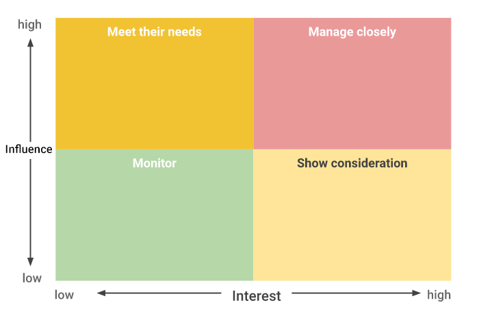
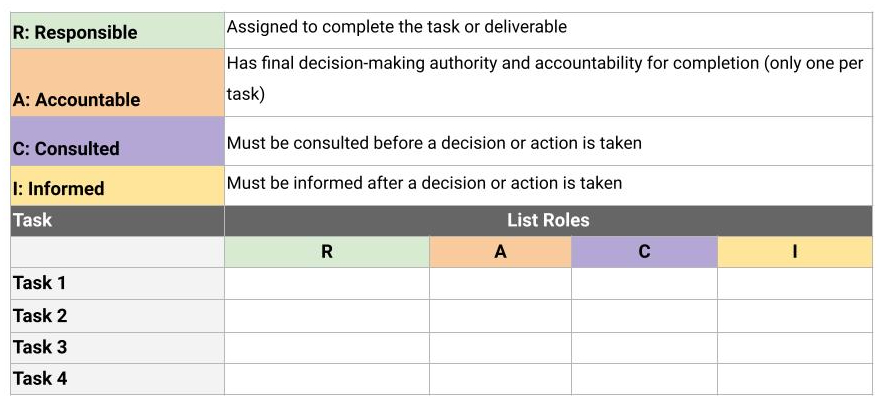
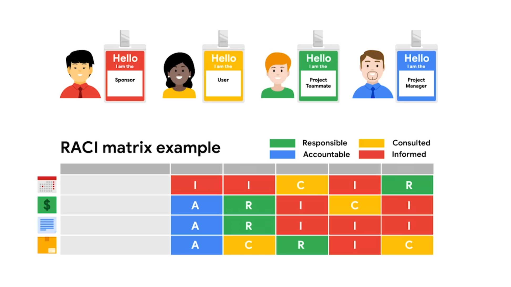

# Working effectively with stakeholders

## The building blocks of a project dream team
Team size, skills, availability, and motivation are the building blocks to creating your very own dream team. Always keep in mind that a project manager does not just select dream teams, they create dream teams through collaboration under great leadership. This is the leadership that you will provide as a project manager. 

### The right skills and abilities to fill the role
Multiple roles exist in every project. On smaller teams, multiple roles may be filled by one person. To meet the needs of more specialized projects, project managers might require people who have the necessary technical skills. Technical skills are the skills specific to the task that needs to be performed. Technical skills are highly valued, but they are not the only skills that are important for high functioning teams. Interpersonal skills, also known as people skills or soft skills, such as patience and conflict mediation, can help team members. This allows the team to blend their technical expertise with collaborative skills in order to get the job done. When a team applies their interpersonal skills, they can minimize team-related issues. Problem-solving skills are a must for all team members, especially when it comes to large, complex projects. As a project manager, you will not be able to solve every problem for your team. At some point, they will need to use their own judgment to problem-solve and get the work done. An underrated skill set for project team members are leadership skills. Strong leadership skills help team members navigate organizational boundaries and effectively communicate with stakeholders to generate buy-in. 

### Who is available?
In projects, the availability of your team is always a big concern. This is especially true in Matrix organizations, where team members have multiple bosses. It is not uncommon to pull a team member onto another project before your project is complete. In a perfect world, you only pick those who can stay on the project for its entire life cycle. You may find that you don’t get to pick certain members of your team at all, which is called a pre-assignment. In these cases, the sponsor assigns team members to your project. Keep in mind that you need to value diversity early on when building your team. On diverse teams, everyone is able to use their unique professional and personal experiences to contribute to a more successful project. Diversity is best leveraged when it is acknowledged and highlighted as an asset. Many people avoid discussing their differences, but if you encourage those conversations, you will find a richer understanding and greater creativity that comes from people working together across identity differences. To do this effectively, it is important to dedicate time early on in the team building process to develop trust between team members. Team members who understand one another are more likely to trust each other and feel safe sharing different points of view or offer a competing perspective. This will also allow them to more easily offer constructive feedback or be supportive if the team dynamics face challenges at any point.

### What motivates them?
Be sure to take note of the motivation level of your team members and the impact it may have on your project. Just because a person is pre-assigned to a project, doesn’t necessarily mean they have low interest in it, but a person who proactively volunteered for it may have additional motivation to do the work. As a project manager, it is your responsibility to engage your team and keep them motivated. This is where your influence as a leader is required to keep the team engaged and ready to overcome any obstacles that may appear. Engaging in a respectful manner and maintaining a positive outlook with your team during times of adversity are simple ways to keep your team motivated.  

## Essential project roles
Although the roles involved in each project will vary, all projects will include a project manager and primary stakeholders who are directly impacted by the project’s outcome, such as team members, senior leaders, the customer, and the project sponsor. Secondary stakeholders, whose work less directly impacts the project, may also play a role. Keep these roles in mind as we take a closer look at the importance of stakeholders.

### The project manager
Although all team members are responsible for their individual parts of the project, the project manager is responsible for the overall success of the team, and ultimately, the project as a whole. A project manager understands that paying close attention to team dynamics is essential to successfully completing a project, and they use team-building techniques, motivation, influencing, decision-making, and coaching skills, to keep their teams strong. Project managers integrate all project work by developing the project management plan, directing the work, documenting reports, controlling change, and monitoring quality. In addition, project managers are responsible for balancing the scope, schedule, and cost of a project by managing engagement with stakeholders. When managing engagement with stakeholders, project managers rely on strong communication skills, political and cultural awareness, negotiation, trust-building, and conflict management skills.

### Stakeholders
Have you ever heard the phrase “the stakes are high"? When we talk about “stakes,” we are referring to the important parts of a business, situation, or project that might be at risk if something goes wrong. To hold stake in a business, situation, or project means you are invested in its success. There will often be several parties that will hold stake in the outcome of a project. Each group’s level of investment will differ based on how the outcome of the project may impact them. Stakeholders are often divided into two groups: primary stakeholders, also known as key stakeholders, and secondary stakeholders. A primary stakeholder is directly affected by the outcome of the project, while a secondary stakeholder is indirectly affected by the outcome of the project. Primary stakeholders usually include team members, senior leaders, and customers. For example, imagine that you are a project manager for a construction company that is commissioned to build out a new event space for a local catering company. On this project, the owners of the catering company would be primary stakeholders since they are paying for the project. Another primary stakeholder could be the CEO of your construction company. If the CEO likes to be directly involved with projects for local businesses like the catering company, that would make them a primary stakeholder. An example of a secondary stakeholder might be the project’s point of contact in legal. While the project outcome might not affect them directly, the project itself would impact their work when they process the contract. Each project will have a different set of stakeholders, which is why it’s important for the project manager to know who they are, what they need, and how to communicate with them.

### Project team members 
Every successful team needs strong leadership and membership, and project management is no exception! Project team members are also considered primary stakeholders, since they play a crucial role in getting the job done. Your team members will vary depending on the type, complexity, and size of the project. It’s important to consider these variables as you select your project team and begin to work with them. Remember that choosing teammates with the right technical skills and interpersonal skills will be valuable as you work to meet your project goals. If you are not able to select your project team, be sure to champion diversity and build trust to create harmony within the team. 

### Sponsor
The project sponsor is another primary stakeholder. A sponsor initiates the project and is responsible for presenting a business case for its existence, signing the project charter, and releasing resources to the project manager. The sponsor is very important to the project, so it’s critical to communicate with them frequently throughout all project phases. In our construction company example, the CEO could also be the project sponsor.

## Conducting a stakeholder analysis 
Stakeholders are an essential part of any project. A project manager’s ability to balance stakeholder requirements, get their buy-in, and understand when and how to involve them is key to successfully fulfilling a project. It is key to keep stakeholders organized in order to understand when and how to involve them at the right time.

Let’s review the key steps in the stakeholder analysis:
1. Make a list of all the stakeholders the project impacts. When generating this list, ask yourself: Who is invested in the project? Who is impacted by this project? Who contributes to this project? 
2. Determine the level of interest and influence for each stakeholder—this step helps you determine who your key stakeholders are. The higher the level of interest and influence, the more important it will be to prioritize their needs throughout the project. 
3. Assess stakeholders’ ability to participate and then find ways to involve them. Various types of projects will yield various types of stakeholders—some will be active stakeholders with more opinions and touchpoints and others will be passive stakeholders, preferring only high-level updates and not involved in the day-to-day. That said, just because a stakeholder does not participate as often as others does not mean they are not important. There are lots of factors that will play a role in determining a stakeholder’s ability to participate in a project, like physical distance from the project and their existing workload. 

**Pro tip**: You might want to form a steering committee during some projects. A steering committee is a collection of key stakeholders who have a high level of power and interest in a project. A steering committee can influence multiple departments within the organization, which means that they have the potential to release a greater number of resources to the project manager.  

### Visualizing your analysis
A power grid shows stakeholder interest in the project versus their influence over the project. This four-quadrant tool helps project managers evaluate how to manage their stakeholders. It is used to determine the appropriate level of engagement required by the project team needed to gain the stakeholders’ trust and buy-in. The upper half of the grid represents higher influence, and the lower half of the grid represents lower influence. Meanwhile, the left half of the grid represents lower interest, and the right half of the grid represents higher interest. With that in mind, you'll find the upper left quadrant to be labeled "meets their needs," the upper right quadrant "manage closely," the bottom left quadrant is labeled "monitor," and the bottom right quadrant is labeled "show consideration."  

Take the time at the start of the project to establish your stakeholder approach. List the stakeholders and then place them into the appropriate places on the grid. Being able to visualize their placement will help you manage communications and expectations. Having a quick reference tool to drive your communication actions will also allow you to have the ability to spend more time doing other tasks on your project.

### Quadrant 1: High Influence, High Interest (Upper Right)
Stakeholders in this quadrant have a significant influence on the project and are highly interested in its outcome. They can greatly impact project decisions and success. Examples might include project sponsors, key executives, or regulatory authorities. Responses for this quadrant include:

1. Engagement and Involvement:
- Keep these stakeholders well-informed and engaged throughout the project lifecycle.
- Involve them in decision-making processes, seeking their input and feedback.
- Address their concerns promptly and effectively.

2. Regular Communication:
- Schedule regular meetings or updates to keep them informed about project progress and any issues.
- Tailor communication to their preferences and needs to ensure they remain supportive and engaged.

### Quadrant 2: High Influence, Low Interest (Upper Left) 
Stakeholders in this quadrant have high influence but may not be deeply interested in the day-to-day project details. They might include senior managers who need to be informed but may not be actively engaged. Responses for this quadrant include:

1. Executive Summaries:
- Provide high-level summaries of project progress and key decisions for their review.
- Focus on the impact of the project on organizational goals and objectives.

2.Periodic Updates:
- Provide periodic briefings or updates to ensure they are informed of major milestones and critical project changes.

### Quadrant 3: Low Influence, High Interest (Bottom Right) 
Stakeholders in this quadrant have a high interest in the project but relatively low influence on its outcome. They are typically looking for updates and information about the project. Responses for this quadrant include:

1. Regular Updates:
- Communicate project progress, risks, and updates to keep them engaged and informed.
- Address their queries and concerns promptly to maintain their interest.

2. Stakeholder Feedback:
- Seek their feedback on project plans, progress, and outcomes to ensure their perspective is considered.

### Quadrant 4: Low Influence, Low Interest (Bottom Left)
Stakeholders in this quadrant have low influence on the project and limited interest in its details. They might include lower-level employees or departments not directly impacted by the project. Responses for this quadrant include:

1. General Communication:
- Share general updates about the project's overall progress without overwhelming them with details.
- Address any specific questions they may have, but avoid unnecessary inundation with project-related information.

2. Minimal Engagement:
- Maintain a basic level of communication and engagement to keep them aware of the project without distracting them from their regular responsibilities.

By understanding the influence and interest of stakeholders using a four-quadrant power grid, project managers can tailor their communication and engagement strategies to effectively manage stakeholder relationships throughout a project life cycle. 

### Generating stakeholder buy-in 
Once you organize and assess your stakeholders, it is time to start making some decisions on whose buy-in is absolutely necessary for success, whose requirements deserve the most attention, and what level of communication each stakeholder will require. Gaining key stakeholder buy-in is essential to ensuring that your project is not deprioritized or deprived of resources. 

Tips for gaining key stakeholder buy-in include: 
- Clearly mapping the work of the project to the goals of the stakeholder.
- Describing how the project aligns with the goals of the stakeholder's department or team.
- Listening to feedback from the stakeholder and finding ways to incorporate their feedback into the project's charter where appropriate.

Manage your stakeholders’ expectations by presenting a realistic view of your team’s abilities. Do not over-promise and under-deliver! 

## Building out a RACI chart
A RACI chart can be an extremely effective way to define project roles, give direction to each team member and stakeholder, and ensure work gets done efficiently. Having a RACI chart available throughout the duration of your project as a quick visual can be invaluable. In this reading, we will cover the function of a RACI chart and its components and explore how project managers use RACI charts to define and document project roles and responsibilities. 

### Elements of a RACI chart
A RACI chart creates clear roles and gives direction to each team member and stakeholder. Over your career, you may hear a RACI chart referred to as a Responsibility Assignment Matrix (RAM), RACI diagram, or RACI matrix. The ultimate goal of this chart is to clarify each person’s role on your project. 

First, let’s break down each of the roles people can be assigned:
- R: Responsible: who gets the work done
- A: Accountable: who makes sure the work is done
- C: Consulted: who gives input or feedback on work
- I: Informed: who needs to know the outcome

Note that RACI charts can be organized in different ways,  depending on personal preference, number of tasks being assigned, and number of people involved. In the previous video, we showed you one RACI chart format. The template below shows another way a typical RACI chart might be organized.

## Why projects fail: Initiation missteps
- Unclear expectations
- Unrealistic expectations
- Miscommunication
- Lack of resources
- Scope creep

Taking the time to clarify expectations—particularly around communication methods, resources available, and scope—during the initiation phase will increase the chances of your project’s success. Even if you follow these best practices, you may still encounter failure. Remember that in every failure, there is the opportunity to learn, grow, and do better the next time.
